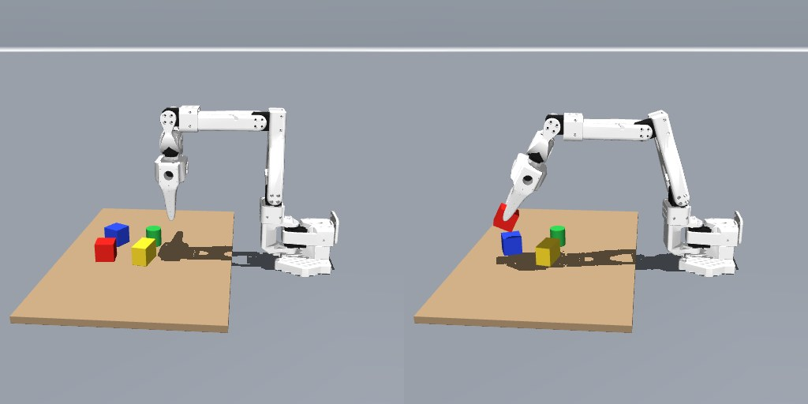
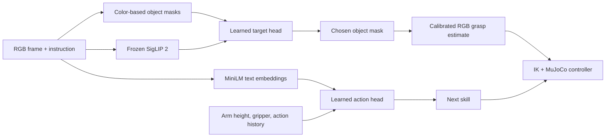

# SO-100 RGB + language tabletop demo

A MuJoCo SO-100 arm receives a free-text instruction, sees a **single fixed RGB camera**, and tries to reach, grasp, lift, move, or release one of four colored tabletop objects. The browser UI is the simulator, a text box, Run, and a speed slider.

This is a simulation prototype. It has **not** been tested on a physical SO-100 or on arbitrary household objects.

## Watch real policy runs

These videos were recorded from the same `ActionDemo` policy and MuJoCo simulation used by the browser. The linked stills show the first and last frames; the recordings include the arm's actual movement.

| Instruction | Recording |
| --- | --- |
| “go near the blue cube” | [](media/go-near-blue.mp4) |
| “please grab the red block and hold it up” | [](media/lift-red.mp4) |
| “lift the green tube and put it down on the right” | [](media/move-green-right.mp4) |

## Run it

On Apple Silicon macOS with Homebrew and [uv](https://docs.astral.sh/uv/):

```bash
git clone https://github.com/TarunTomar122/so100-rgb-language-policy.git
cd so100-rgb-language-policy
brew install molten-vk
uv sync
source scripts/vulkan_env.sh
uv run python -m so100.action_demo
```

Open **http://127.0.0.1:8772/**. The first run downloads pretrained SigLIP 2 and MiniLM weights from Hugging Face; the two small trained heads are already in `data/`. On another platform, provide a working MuJoCo renderer and skip the macOS Vulkan script.

To check the end-to-end policy or regenerate the recordings:

```bash
uv run python -m so100.action_demo --check
uv run python -m so100.eval_action_demo --near
uv run python -m so100.eval_action_demo --final
uv run python -m scripts.record_demos  # also needs ffmpeg on PATH
```

## How it works



The target head chooses among **four RGB color clusters**. The grasp estimator uses the calibrated side camera, known table plane, and an assumed object top height to turn image pixels into a 3D grasp point and orientation. It does not consume a depth image. The action head predicts one of `reach`, `lower`, `close`, `lift`, `left`, `right`, `up`, `down`, `open`, and `done` from text embeddings, arm state, and prior skills. IK turns the chosen skill into joint targets. A fresh RGB frame checks the lift and triggers a limited grasp retry when needed.

The skills and geometry are engineered; **target choice and skill choice are learned**. Simulator object positions are used for scene generation, training labels, and evaluation, not for runtime motion selection.

## Current boundary

- The four objects have distinct saturated colors and approximately known 30 mm height. RGB clustering, fixed camera calibration, and known table geometry are part of this prototype.
- Free text is accepted, but the head only has ten skills. It can choose an unhelpful skill or `done` for a command it cannot express. There is no rule that rejects “unsupported” sentences.
- “Drop” currently means open the gripper; it does not plan a stable placement. “Move left/right” uses fixed 3 cm steps in the camera's frame.
- No real camera calibration, actuator calibration, or sim-to-real transfer has been verified yet.

See [EXPERIMENTS.md](EXPERIMENTS.md) for the path from click-to-IK to this demo, the recorded test results, and the main failures. The SO-100 model attribution and pretrained model links are in [NOTICE.md](NOTICE.md).

The frozen policy's [unfamiliar-object, environment, and image-noise stress test](eval/ood-v1/REPORT.md) includes every trial result, same-seed controls, failure images, and videos. No retraining was done for that test.
