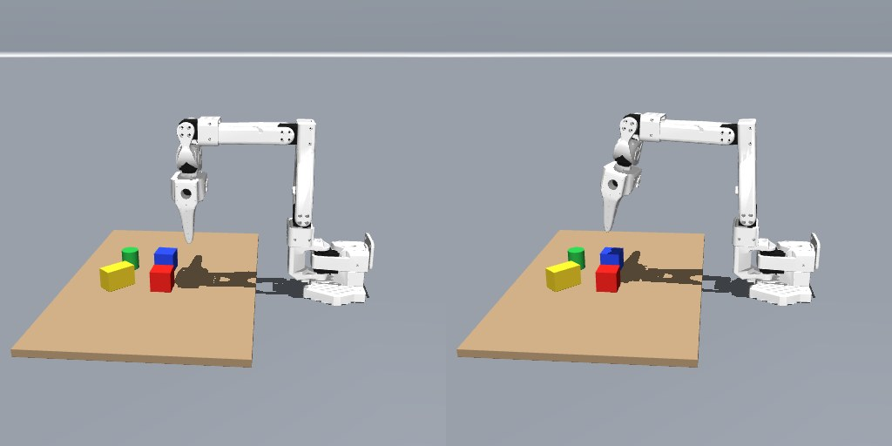
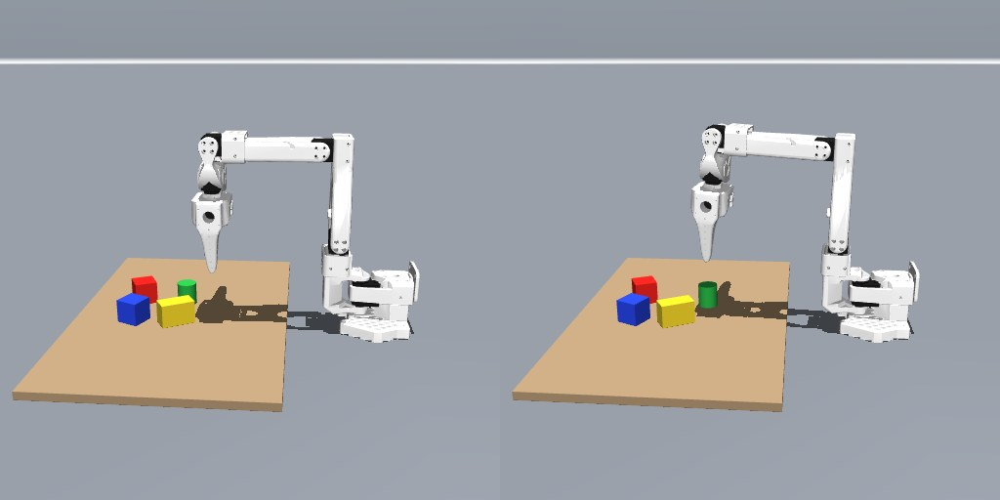
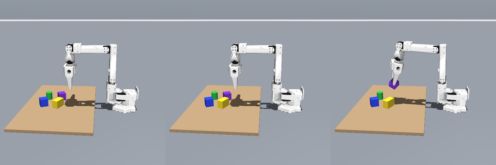
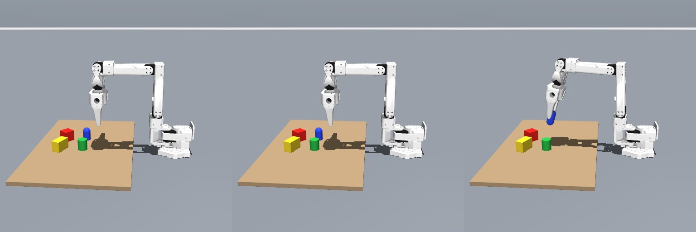
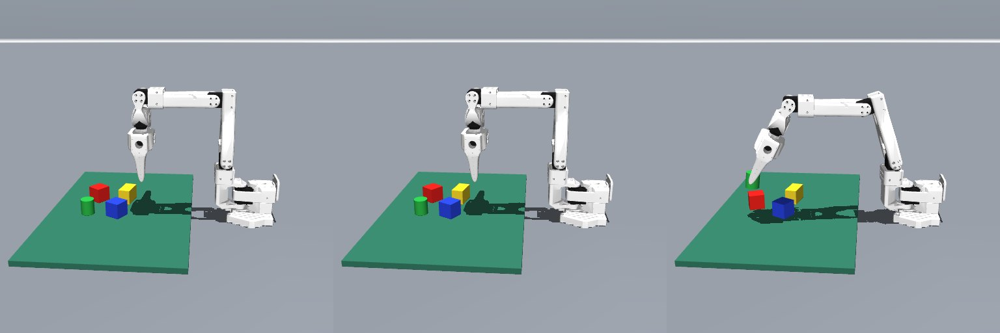
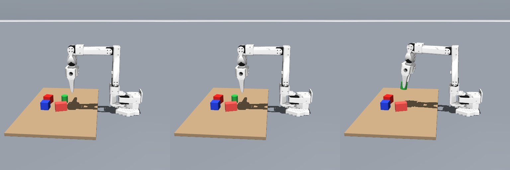
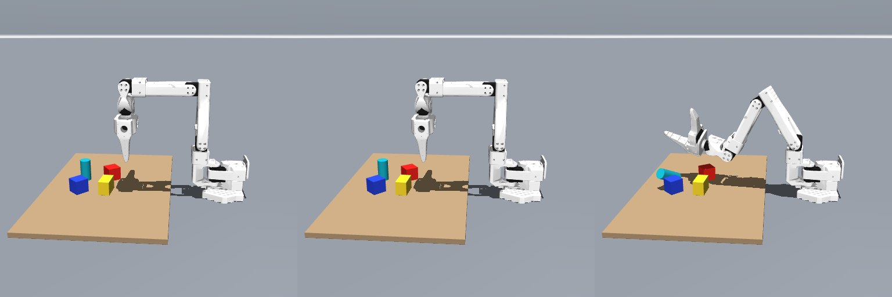

# SO-100 RGB + language tabletop policy

A MuJoCo SO-100 arm takes free-text commands and a **single fixed RGB camera** image, chooses a tabletop object, estimates a grasp, and executes skills through IK. This is a simulation experiment. It has **not** been tested on a physical SO-100 or arbitrary household objects.

## Watch actual policy runs

Every MP4 below records the arm executing the current policy in MuJoCo. The stills show the initial RGB observation and final scene. Failures are included deliberately.

| Command and outcome | Recording |
| --- | --- |
| “go near the blue cube” — approaches with jaws open | [](media/go-near-blue.mp4) |
| “lift the green tube and put it down on the right” — compound instruction | [](media/move-green-right.mp4) |
| “lift the violet cube” — unseen color, succeeds | [](eval/ood-v2/clips/holdout/violet-cube.mp4) |
| “lift the blue capsule” — unseen shape, succeeds | [](eval/ood-v2/clips/holdout/blue-capsule.mp4) |
| “lift the green cylinder” on a teal table — succeeds; held object becomes occluded | [](eval/ood-v2/clips/stress/teal-table.mp4) |
| “pick up the coral block” — fails by selecting another object | [](eval/ood-v2/clips/holdout/coral-block.mp4) |
| “pick up the cyan tube” — fails at contact | [](eval/ood-v2/clips/holdout/tall-cyan-tube.mp4) |

## Run

Tested on a 32 GB Apple Silicon Mac with Homebrew, [uv](https://docs.astral.sh/uv/), and MoltenVK:

```bash
git clone https://github.com/TarunTomar122/so100-rgb-language-policy.git
cd so100-rgb-language-policy
brew install molten-vk
uv sync
source scripts/vulkan_env.sh
uv run --frozen python -m so100.action_demo
```

Open **http://127.0.0.1:8772/**. The first run downloads frozen [SigLIP 2](https://huggingface.co/google/siglip2-base-patch16-256) and [Qwen3-4B-Instruct](https://huggingface.co/Qwen/Qwen3-4B-Instruct-2507) weights; they are not stored in this repo. The local language planner requires substantially more memory than the earlier tiny action head.

## How the current policy works

1. The simulator captures an **empty-table RGB reference** with the same fixed camera before placing objects. Foreground change filters table pixels; color clustering proposes visible object masks.
2. Frozen SigLIP 2 compares crops of those masks with the full instruction and chooses one. RGB pixels, camera calibration, and an assumed 30 mm object height provide a 3D grasp estimate. **No depth image or simulator object pose is used for motion selection.**
3. Frozen Qwen3-4B plans a sequence from the existing `reach`, `lower`, `close`, `lift`, `left`, `right`, `up`, `down`, `open`, `done` skills. IK and the MuJoCo controller execute them. RGB and jaw opening check the lift; if the camera loses sight of a held object, the policy records that uncertainty.

The earlier trained target and GRU action heads are retained in `data/` and their training scripts, but the current browser policy does **not** load or retrain them. The planner receives skill meanings in its prompt. Unsupported instructions can lead to an empty, invalid, or unhelpful model plan; there is no special `unsupported` action or phrase-specific rule.

## Measured results and limits

| Scene set | Completed correctly |
| --- | ---: |
| Original frozen policy stress test | 16 / 28 |
| Revised policy on those same, already inspected scenes | **21 / 28** |
| New holdout scenes | **8 / 13** |
| Second fresh set | **6 / 10** |

These are seeded simulation scenes, not real-world success rates. The detailed [evaluation report](eval/ood-v2/REPORT.md) links every result, failure frame, and recorded video; [research notes](docs/robustness-research.md) cite the primary sources and tested alternatives.

The current proposal stage still expects four mostly distinct, saturated objects. Similar colors can merge, flat/tall objects break the fixed-height grasp, and the gripper can miss even when target selection and IK are correct. The single view can also lose sight of an object inside the jaws. The browser marks completion of the **plan**, not a verified physical success. An external simulator grader uses object poses only to score these experiments.

Reproduce the checks and recordings:

```bash
source scripts/vulkan_env.sh
uv run --frozen python -m so100.action_demo --check
uv run --frozen python -m scripts.eval_ood --output eval/ood-v2/stress
uv run --frozen python -m scripts.eval_ood --mode holdout --output eval/ood-v2/holdout
uv run --frozen python -m scripts.eval_ood --mode fresh --output eval/ood-v2/fresh
uv run --frozen python -m scripts.record_demos  # ffmpeg required
```

See [EXPERIMENTS.md](EXPERIMENTS.md) for the path from click-to-IK to this policy and [NOTICE.md](NOTICE.md) for model and robot attribution.

## Experimental visual action head

A separate [closed-loop visual action experiment](eval/visual-action-v1/REPORT.md) feeds fresh RGB features to the earlier action head after every skill. It keeps object localization and IK responsible for coordinates. It recovered one moved-object pickup and completed both tested pick/carry/release commands, but scored **3/10** on pre-existing unfamiliar scenes versus **6/10** for the default policy. Run `uv run --frozen python -m so100.visual_action_demo` for its separate browser demo on port **8773**; it has not replaced the default policy.
